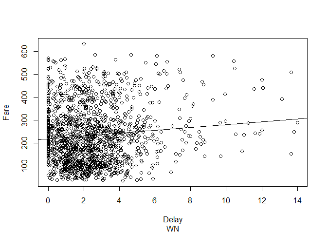

Analysis of Fares and Operational Efficiency
================

We begin by pulling in fare data and specifying major airlines to analyze.

``` r
flight_data <- read.csv('Data/PRIMARY_flight_traffic.csv')
fares <- read.csv('Data/fares.csv')

airline_ids_keep <- c("UA", "AA", "US", "F9", "B6", "OO", "AS", "NK", "WN", "DL", "EV", "HA", "MQ", "VX")

fares <- fares %>%
  filter(airline_id %in% airline_ids_keep)

fares[1,]
```

    ##   quarter airline_id origin_airport destination_airport distance X10 X20
    ## 1       1         AA            CLT                 SGF      708   2   6
    ##   X30 X40 X50 X60 X70 X80 X90 X100 X110 X120 X130 X140 X150 X160 X170 X180
    ## 1  11  15  32  34  43  47  38   40   26   26   19   19   16   25   18   14
    ##   X190 X200 X210 X220 X230 X240 X250 X260 X270 X280 X290 X300 X310 X320
    ## 1   18   13   14    7   13   19    5    8    5    3    3    7    9    1
    ##   X330 X340 X350 X360 X370 X380 X390 X400 X410 X420 X430 X440 X450 X460
    ## 1    4    3    6    2    2    3    5    0    1    2    2    2    1    0
    ##   X470 X480 X490 X500 X510 X520 X530 X540 X550 X560 X570 X580 X590 X600
    ## 1    1    3    1    2    1    1    1    0    0    2    1    0    1    1
    ##   X610 X620 X630 X640 X650 X660 X670 X680 X690 X700 X710 X720 X730 X740
    ## 1    1    0    0    1    0    0    0    0    0    0    0    0    0    0
    ##   X750 X760 X770 X780 X790 X800 X810 X820 X830 X840 X850 X860 X870 X880
    ## 1    0    0    0    0    1    0    0    0    0    0    0    0    0    0
    ##   X890 X900 X910 X920 X930 X940 X950 X960 X970 X980 X990 X1000 X1010 X1020
    ## 1    0    0    0    1    0    0    0    1    0    0    0     0     0     0
    ##   X1030 X1040 X1050 X1060 X1070 X1080 X1090 X1100 X1110 X1120 X1130 X1140
    ## 1     0     0     1     0     0     0     0     0     0     0     0     0
    ##   X1150 X1160 X1170 X1180 X1190 X1200 X1210 X1220 X1230 X1240 X1250 X1260
    ## 1     0     0     0     0     0     0     0     0     0     0     0     0
    ##   X1270 X1280 X1290 X1300 X1310 X1320 X1330 X1340 X1350 X1360 X1370 X1380
    ## 1     0     0     0     0     0     0     0     0     0     0     0     0
    ##   X1390 X1400 X1410 X1420 X1430 X1440 X1450 X1460 X1470 X1480 X1490 X1500
    ## 1     0     0     0     0     0     0     0     0     0     0     0     0
    ##   X1510 X1520 X1530 X1540 X1550 X1560 X1570 X1580 X1590 X1600 X1610 X1620
    ## 1     0     0     0     0     0     0     0     0     0     0     0     0
    ##   X1630 X1640 X1650 X1660 X1670 X1680 X1690 X1700 X1710 X1720 X1730 X1740
    ## 1     1     0     0     0     0     0     0     0     0     0     0     0
    ##   X1750 X1760 X1770 X1780 X1790 X1800 X1810 X1820 X1830 X1840 X1850 X1860
    ## 1     0     0     0     0     0     0     0     0     0     0     0     0
    ##   X1870 X1880 X1890 X1900 X1910 X1920 X1930 X1940 X1950 X1960 X1970 X1980
    ## 1     0     0     0     0     0     0     0     0     0     0     0     0
    ##   X1990 X2000 X2010 X2020 X2030 X2040 X2050 X2060 X2070 X2080 X2090 X2100
    ## 1     0     0     0     0     0     0     0     0     0     0     0     0
    ##   X2110 X2120 X2130 X2140 X2150 X2160 X2170 X2180 X2190 X2200 X2210 X2220
    ## 1     0     0     0     0     0     0     0     0     0     0     0     0
    ##   X2230 X2240 X2250 X2260 X2270 X2280 X2290 X2300 X2310 X2320 X2330 X2340
    ## 1     0     0     0     0     0     0     0     0     0     0     0     0
    ##   X2350 X2360 X2370 X2380 X2390 X2400 X2410 X2420 X2430 X2440 X2450 X2460
    ## 1     0     0     0     0     0     0     0     0     0     0     0     0
    ##   X2470 X2480 X2490 X2500
    ## 1     0     0     0     0

Right now, we don't have actual average fare data for the flight - we have the number of people who paid within a bucket (of size 10). We need to convert this to an average fare paid, per quarter, per route.

``` r
#calculate the price from the bucket data in the fares DB 
price <- seq(from = 15, to = 2505, by = 10) #assume in each bucket, avg fare is middle bucket

#get the total sum spent per bucket
sum_fares_per_bucket <- data.frame(mapply(`*`,fares[, 6:255],price))

#sum all the bucket fares and divide by the total number of people who bought tickets
totalFaresPerFlight <- rowSums(sum_fares_per_bucket)
totalPeoplePerFlight <- rowSums(fares[, 6:255])

fares$avg_fare <-  totalFaresPerFlight/totalPeoplePerFlight

select(fares, c("airline_id", "origin_airport", "destination_airport", "quarter", "avg_fare"))[1:5,]
```

    ##   airline_id origin_airport destination_airport quarter  avg_fare
    ## 1         AA            CLT                 SGF       1 166.22750
    ## 2         DL            DTW                 SAN       1 471.55466
    ## 3         DL            MSP                 ISN       1 130.69024
    ## 4         AA            CLT                 RDU       1  32.28124
    ## 5         DL            ATL                 RIC       1 114.96981

Now that we have the average fare in USD paid per route in each quarter, we can aggregate this across quarters and split the data to look at fares by airline and route.

``` r
#so i can join back in when I group by airline
route_distances <- fares %>%
  mutate(route = paste(origin_airport, destination_airport)) %>%
  select(c("route", "distance", "origin_airport", "destination_airport"))

#summarise the average fare per airline per route
route_fares <- fares %>%
  mutate(route = paste(origin_airport, destination_airport)) %>%
  group_by(airline_id, route, origin_airport, distance) %>%
  summarise(avg_fare = mean(avg_fare))

route_fares[1:5,]
```

    ## # A tibble: 5 x 5
    ## # Groups:   airline_id, route, origin_airport [5]
    ##   airline_id   route origin_airport distance  avg_fare
    ##       <fctr>   <chr>         <fctr>    <int>     <dbl>
    ## 1         AA ABE CLE            ABE      339  63.33333
    ## 2         AA ABE CLT            ABE      481 123.32242
    ## 3         AA ABE PHL            ABE       55  22.21275
    ## 4         AA ABI DFW            ABI      158  40.20488
    ## 5         AA ABQ ATL            ABQ     1269 115.00000

The question we want to examine is: Holding the airline and route distance constant, do higher delays caused at airports correlate with lower fares at that airport?

``` r
#dataset created separately to group airlines with delays
delays <- read.csv('Data/delays.csv')

#Join route delays to fare information
route_fares_delays <- inner_join(route_fares, delays, by = 'origin_airport') %>%
  mutate(route_dist = cut(distance, breaks=seq(0,1500, by=100)))
```

    ## Warning: Column `origin_airport` joining factors with different levels,
    ## coercing to character vector

``` r
#Filter to a specific airline for analysis
airline_filter <- "DL"

route_dist_by_airline <- route_fares_delays %>%
  group_by(airline_id, route_dist, origin_airport) %>%
  summarize(avg_fare_airport = mean(avg_fare), avg_delay_airport = mean(Avg..Total.Departure.Delay)) %>%
  filter(airline_id == "DL")

#hold distance constant, plot a scatterplot for each distance segment
unique_route <- unique(route_dist_by_airline$route_dist)

i <- 0 #limit for example purposes
for(route in unique_route)
{
  if(i<5)
  {
    selected_route <- filter(route_dist_by_airline, route_dist == route)
      
    plot(selected_route$avg_delay_airport, selected_route$avg_fare_airport, sub = paste("Flight Distance Between: ", route), main = paste(airline_filter, "Flights"), xlab="Delay (minutes)", ylab="Fare (USD $)")
        
    abline(lm(selected_route$avg_fare_airport ~ selected_route$avg_delay_airport))
  }
  i <- i+1
}
```


Looking at the scatterplots, we have identified no clear trend between fare prices and the delays inherent at different airports. Given this, we look to explore if operational efficiency within airlines affects the fares they are able to charge.

``` r
flight_data[is.na(flight_data)] <- 0
flight_data <- flight_data %>%
  filter(flight_data$airline_id %in% airline_ids_keep)

#Get the average delay for each domestic route in the US
airline_delay_by_airport <- flight_data %>%
  mutate(route = paste(origin_airport, destination_airport)) %>%
  group_by(airline_id, route) %>%
  summarize(delay_minutes = mean(airline_delay))

airline_delay_by_airport[1:2, ]
```

    ## # A tibble: 2 x 3
    ## # Groups:   airline_id [1]
    ##   airline_id   route delay_minutes
    ##       <fctr>   <chr>         <dbl>
    ## 1         AA ABQ DFW     0.7166667
    ## 2         AA ABQ ORD     0.0000000

``` r
#Join delay information with fare price information
fares_airline_caused_delays <- inner_join(airline_delay_by_airport, route_fares, by = c("airline_id", "route"))
```

    ## Warning: Column `airline_id` joining factors with different levels,
    ## coercing to character vector

``` r
fares_airline_caused_delays[1,]
```

    ## # A tibble: 1 x 6
    ## # Groups:   airline_id [1]
    ##   airline_id   route delay_minutes origin_airport distance avg_fare
    ##        <chr>   <chr>         <dbl>         <fctr>    <int>    <dbl>
    ## 1         AA ABQ DFW     0.7166667            ABQ      569 148.0924

``` r
#Limit delays to 15 minutes as significant outliers skew the results
fares_airline_caused_delays <- fares_airline_caused_delays[!is.null(fares_airline_caused_delays)] %>%
  filter(delay_minutes < 15) #outliers

unique_airlines <- unique(fares_airline_caused_delays$airline_id)

#For each airline, produce a scatterplot relating fare prices to airline delays
for(airline in unique_airlines)
{
  selected_airline <- filter(fares_airline_caused_delays, airline_id == airline)
  
  plot(selected_airline$delay_minutes, selected_airline$avg_fare, xlab="Delay", ylab="Fare", sub=airline)
  
  abline(lm(selected_airline$avg_fare ~ selected_airline$delay_minutes))
  
  dev.copy(png,filename=paste(airline, ".png"))
  dev.off ()
}
```


